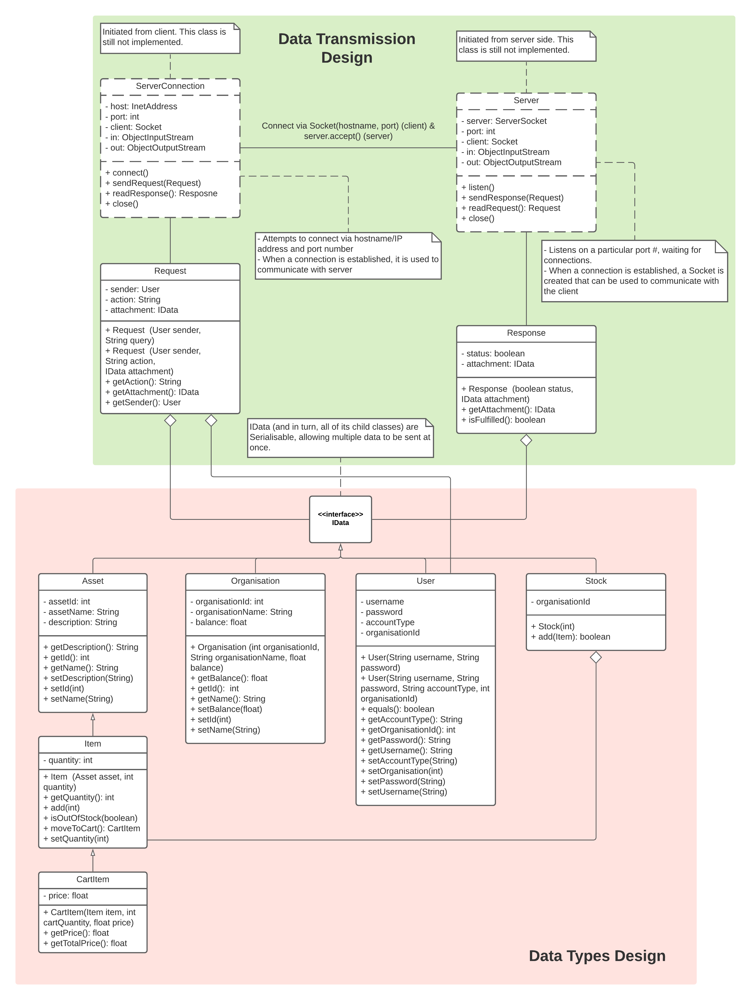

# Common classes 
This package contains design of classes that are used by both server and client.

Includes class design: Designs of the (public) Java classes that will comprise your programs:
- Descriptions of all public methods and fields.
- Descriptions of the arguments each method takes and what the method returns.
- Any assumptions (preconditions and postconditions).
- Any checked exceptions that may be thrown by the method, and the circumstances under which the exceptions will be thrown.
- How these classes interact with each other (UML Diagram).

# Detailed Class Description
Follow the links for detailed description of each class, including its fields & methods.
## Data Types
### [`IData`](../../docs/Detailed_Class_Description/common/dataClasses/IData.html)
Represents a data-containing object that can be serialised and transferred between client and server.

### [`Asset`](../../docs/Detailed_Class_Description/common/dataClasses/Asset.html)
Represents an asset that can be traded in the system.

### [`Item`](../../docs/Detailed_Class_Description/common/dataClasses/Item.html)
Represents an item - an quantifiable version of an asset possessed by an organisation.

### [`CartItem`](../../docs/Detailed_Class_Description/common/dataClasses/CartItem.html)
Represents an item in cart - a version of an asset that is considered to be placed into an order, at a certain quantity and price.

### [`User`](../../docs/Detailed_Class_Description/common/dataClasses/User.html)
Represents a user in the system.

### [`Organisation`](../../docs/Detailed_Class_Description/common/dataClasses/Organisation.html)
Represents an organisation.

### [`Stock`](../../docs/Detailed_Class_Description/common/dataClasses/Stock.html)
Represents a collection of items owned by an organisation.

### [`Order`](../../docs/Detailed_Class_Description/common/dataClasses/Order.html)
Represents an order placed by an organisation.

## Networking Data
### [`Request`](../../docs/Detailed_Class_Description/common/Request.html)
A package containing the request to be sent over the server.

### [`Response`](../../docs/Detailed_Class_Description/common/Response.html)
A package containing a response sent from the server to the client, including the state of whether the request were successfully executed and an optional data-containing object (IData).

# Classes Interaction
The interaction between the common classes is summarised in the Class Diagram below.
