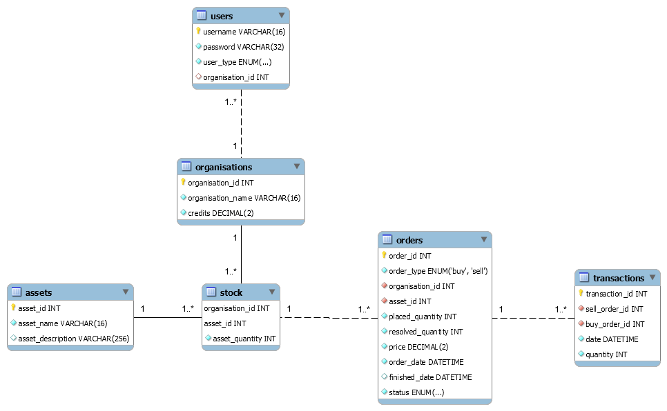

# Database
The design of the database schema
- Tables and table columns (column names and data types)
- How those tables are connected (primary keys and foreign keys)

## Database Schema

## Scripts
[Database Creation](DB_Creation_Script.sql)
