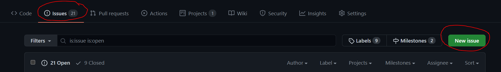
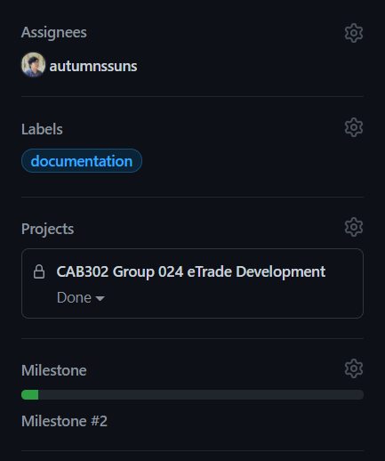
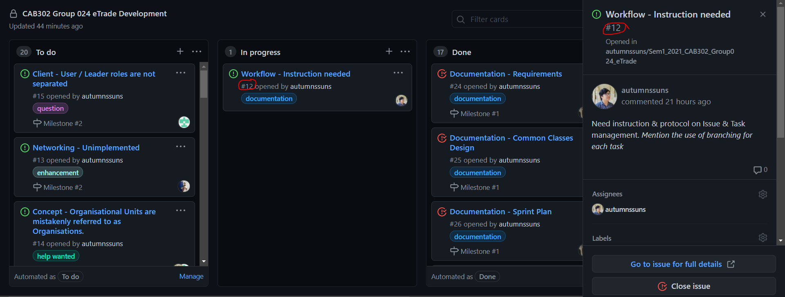
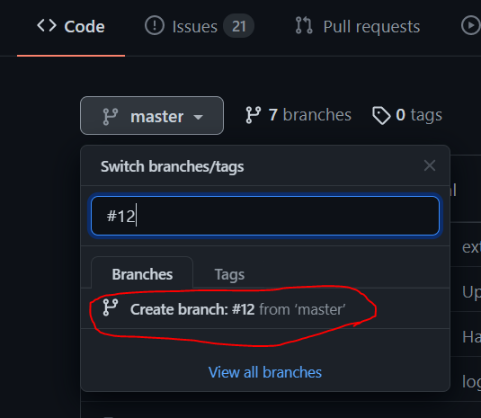
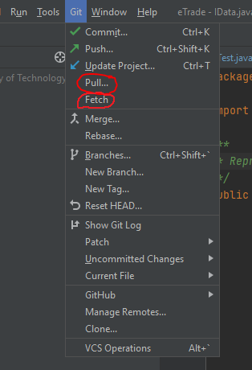
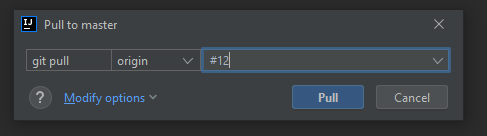
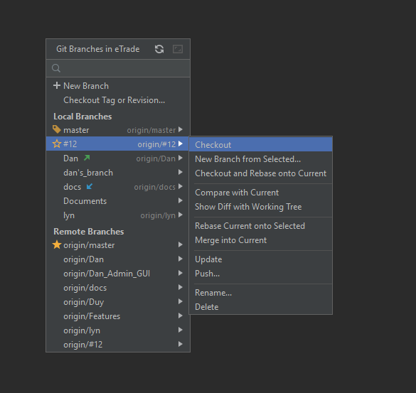
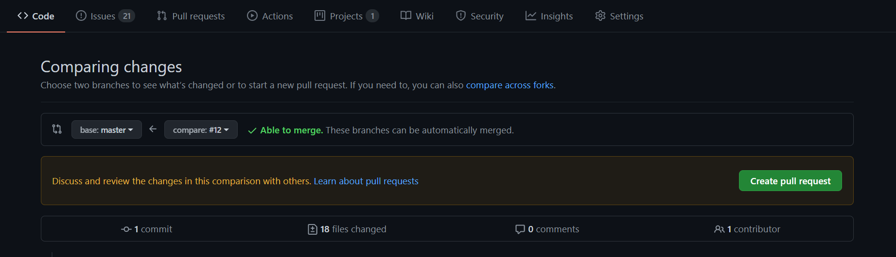
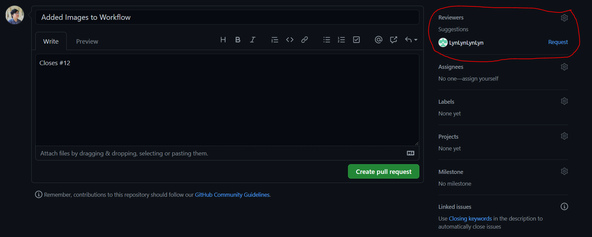

# Workflow with Issues
Guide to work with GitHub's Issue feature for task management. This workflow is considered because of several problems with the previous Contribution_Management workflow:
- Addition of new tasks is tedious & difficult to manage due to the use of a .md document.
- It was difficult to keep track of what each member is working on, which led to potential clash. This also caused some members to not know which part of the project to work on.
- Since each member worked on a different branch and attempt to merge was made at each meeting, the code load on merge(s) was huge and resulted in a large number of conflicts. This also made the git history a mess.
- The member-focused branching also made it difficult to keep track which feature / issue was tackled at a specific pull request.

As a result, an issue-focus workflow using GitHub `Issues` and `Projects` features is considered, where each branch is dedicated to solving one Issue.

TL;DR:
1. Create a New Issue in the `Issue` tab.
2. Adds appropriate Labels, Projects and Milestone
3. In `Projects` tab, move your Issue to the `To Do` column.
4. Create a new branch from `master` and name it `#<Issue number>`.
5. In IntelliJ, Fetch, Pull and Checkout with that branch.
6. Start implement, don't forget to comment and write tests.
7. `Commit and Push` your implementation to the remote repository.
8. Create a `Pull Request` from your branch to `master` and assign reviews if possible.
9. Link the `Pull Request` to your `Issue`.
10. Merge your Pull Request to `master`.
11. If your Issue hasn't been close, do it manually.

## 1. Create an Issue
Issues are foundation of this workflow and it is crucial that you know how to properly create them.

1. Navigate to the [`Issues`](https://github.com/autumnssuns/Sem1_2021_CAB302_Group024_eTrade/issues) tab.
2. Select `New Issue` to create a new Issue.

3. Give a meaningful title and add an adequate amount of information (a few sentences should be enough) to describe the task in the comment section.
4. On the right hand side of the window, consider the 4 properties:
    1. Assignees: Who should the issue be assigned to? It is okay to revisit this later.
    2. Labels: Give appropriate label(s) to the issue.
    3. Projects: (___IMPORTANT___) Ensure the Issue is set to be in the `CAB302 Group 24 eTrade Development` project.
    4. Milestone: Set a deadline for the issue (`Milestone #2` or `Final Submission`).

5. Press `Submit new issue` button.

_Note: You can always edit created issues in the `Issues` tab_

## 2. Manage your Issues
Created Issue(s) are automatically added to the `To Do` list in the project, which you can manage to inform other members of what you are up to.

1. Nagivate to the `Projects` tab and select [`CAB302 Group 024 eTrade Development`](https://github.com/autumnssuns/Sem1_2021_CAB302_Group024_eTrade/projects/1).
2. In the `To Do` column, find an Issue that you plan to work on.
3. Drag the Issue to the `In Progress` column to indicate that you are currently working on it.
4. If the Issue is already assigned, skip this step.
    1. Click on the Issue.
    2. In the pop up window (on the right-hand side), press `Assignees` and add yourself.
5. __Remember the Issue number, you will need it later__

## 3. Branching
After indicating which Issue to work on, you will need to create a new branch and work on the issue from that branch.

1. Navigate to the [master branch](https://github.com/autumnssuns/Sem1_2021_CAB302_Group024_eTrade) of the repository.
2. Press the `master` dropdown and type the Issue number of the issue you are working on.
3. Press `Create branch: #<number> from 'master'`.

4. Pull the newly created branch to IntelliJ.
    1. On the menu, select `Git` -> `Fetch` and wait until a `Fetch Successful` notification pops up on the bottom right corner.
    2. On the menu, select `Git` -> `Pull...`.   
    3. In the pop up window, type in the Issue number and select `Pull`.   
    4. Checkout using the above branch by selecting in the menu `Git` -> `Branches...` and select the pulled branch and press `Checkout`   
5. Start implementing

_Note: During implementation_
- Make frequent local commits (`Ctrl + K` and `Commit`, __NOT__ `Commit and Push...`) whenever you successfully implement any feature.
- Try documenting a class and methods using Javadoc (saying what the class and each method does, including parameters and returns) before implementing. This allows you to write "black box test".
- When applicable, create appropriate tests for the code. Try to make this a habit.
- If you find an issue too big, please split it up into smaller issues and complete the smaller ones first, following the same workflow.

## 4. Push and Create Pull Request
After implementing and commiting your changes locally, you need to push it to the remote repository and create a Pull Request to merge your code with `master`. Before you push, please ensure the following:
- Your code is thoroughly documented.
- Your code is sufficiently tested.
- You are at the correct branch with the correct Issue number.

1. Make your final `Commit and Push...` (`Ctrl + K`) or just `Push` if you have already made your final commit.
2. Navigate to the [`Pull Requests`](https://github.com/autumnssuns/Sem1_2021_CAB302_Group024_eTrade/pulls) tab on GitHub.
3. Create a new Pull Request of your branch to master and try to leave a meaningful comment about the changes you made.
     
5. Link the Pull Request to your Issue, following [this guide](https://docs.github.com/en/github/managing-your-work-on-github/linking-a-pull-request-to-an-issue). _If your Pull Request is linked successfully then your Issue will appear in the `In Review` column of the Project_
6. On the right hand side, assign a groupmate to review your pull request.  
7. Press `Create Pull Request`.

_Note: Once the pull request is approved, it can be merged into the `master` branch. After merging, your Issue will automatically close and be moved to the `Done` column in the Project.
If your Issue is still open, it might have not been linked correctly to the request. In this case you will have to close it manually._