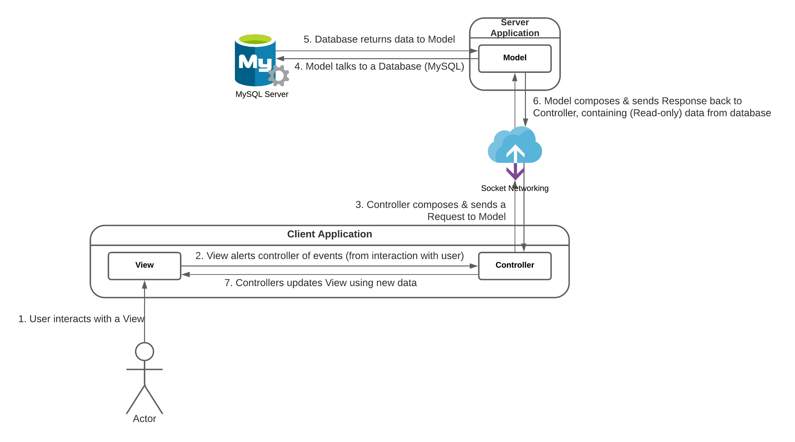

This website contains documents relevant to the development & release of an Electronic Asset Trading Platform as a Major Project for QUT's unit CAB302 - Software Development. On this page are a brief overview of the project and links to other documents.

___This site is intended for the developers and marker(s) only. Please do not share it outside the scope of the intended readers.___

# Overview
The project includes the development of an Electronic Asset Trading Platform for an unnamed client corporation, allowing their organisational units (which will be referred to as "divisions") to trade resources (computational resources, hardware resources, software licenses etc.) across the organisation. Specification of the client's requirement is listed in a separated [Requirement document](Requirements/README.md). The applications in this project is developed in Java and utilises a relational (SQL) database for data storage.



## System Architecture
The project embraces a typical Model - View - Controller (MVC) architecture, with the Client (User-facing application) consists of a View and a Controller. Meanwhile, the Server consits of the Model which can interact with a MySQL server.
- View: Displays using data from controller
- Controller: Stores data for View and can send requests to server to update data
- Model: Talks to database and send responses back to controller.

The above architecture is manifested in two separated applications, a client (containing the View and Controller) and a server (containing the Model). The detailed design of each is covered in separated documents and can be found in the __Other Documents__ section of this page.

## Detailed Design
### Database
A server-side relational database is used in this project. The database schema is modelled using `MySQL Workbench` and interacted with using the `SQLite Database Management System`. 

Details about the database (including an Enhanced Entity Relation diagram) can be found in the [Database Design document](Database).

### Client
The client application has a Graphical User Interface and is developed using the `JavaFX` Framework (version 16), utilising their `JavaFX SDK` and the `SceneBuilder` to create the View and Controller. 

Details about the client application and its classes can be found in the [Client Design document](Client_Design).

### Server
The server is expected to have a Command Line Interface and can connects to the database and execute SQL scripts using the `SQLite JDBC` (version 3.34.0). 

Details about the server application and its classes can be found in the [Server Design document](Server_Design).

### Data Types
To easily store, transmit and read data between the client(s) and server, custom data types are developed and utilised. Instances of these custom data types are attached into packages (`Request` and `Response`) that are sent between the client(s) and server.

Details about the custom data types can be found in the [Common Classes document](Common_Classes).

### Networking
The networking component within this project includes the transmission of `Request`(s) and `Response`(s) between the client(s) and server and is built based on the Java sockets API (found within the `java.net` package). The API allows the use of a `Socket` on the client side and a `ServerSocket` on the server side, supporing reading and writing to `InputStream`(s) and `OutputStream`(s).

The `Request` and `Response` objects and its attachments are serialised when written into the `OutputStream`(s) and can be deserialised when read from the `InputStream`(s).

Details about the network protocol can be found in the [Network Protocol document](Networking). Note: this document contains the networking design only; the classes involved in networking are listed in the Client and Server Design documents.

## Dependencies
The application(s) in this project depends on the following libraries:
- Amazon Corretto Java Development Toolkit (jdk15.0.2_7)
- JavaFX SDK 16
- SQLite JDBC 3.34.0

# Other Documents
1. [Requirements](Requirements/README.md)
2. [Database Design](Database)
3. Application Design
    1. [Client](Client_Design)
    2. [Server](Server_Design)
    3. [Common](Common_Classes)
    4. [Detailed Class Description](Detailed_Class_Description/index.html)
4. [Network Protocol](Networking)
